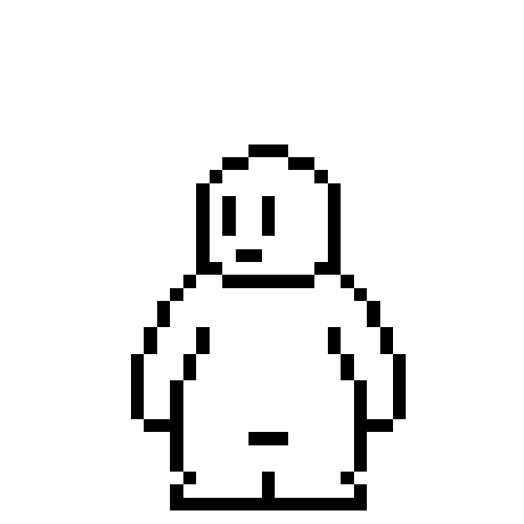

# 05_I-T-HUFS_Charlie

   
  
   

 

## 기술 스택
### Client
| iOS |  Swift  |  HealthKit   |
| :--------: | :------: | :-----: |
|   ![iOS]    | ![swift] | ![healthKit] |

### Server
| TypeScript |  Nest.js   |  MySQL   |
| :--------: | :------: | :-----: |
|   ![ts]    | ![Nest] | ![mysql] |

 

## Core Feature

### 📌 HealthKit 연동

### 📌 Charlie Custom

### 📌 Badge And Mission

 

 

### Team
| [@jiwon11](https://github.com/jiwon11) |  [@hyowon612](https://github.com/hyowon612)   |  [@imeugeneco](https://github.com/imeugeneco)     | [@kanghw7730](https://github.com/kanghw7730) |
| :--------: | :------: | :-----: |  :-----: |
| Client |  Client   |  Server  | Server   | 

 

<!-- Stack Icon Refernces -->
[ts]: /images/stack/typescript.png
[Nest]: /images/stack/nestjs.png
[mysql]: /images/stack/mysql.jpg
[iOS]: /images/stack/ios.png
[swift]: /images/stack/swift.png
[healthKit]: /images/stack/healthKit.png